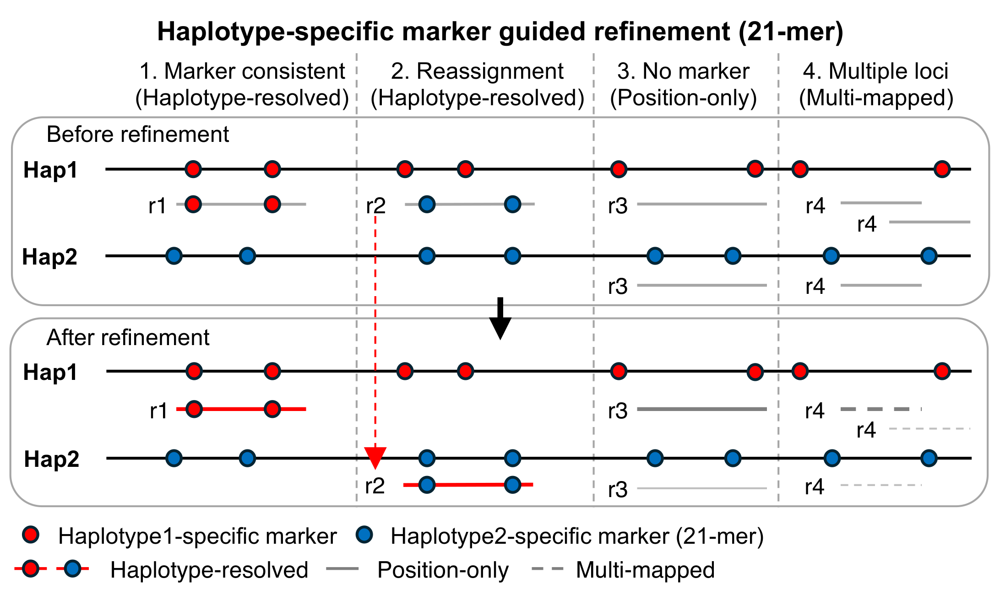

# bam_refiner



Refine long-read alignments on a diploid genome assembly using haplotype-specific k-mers as markers.

When long reads are aligned to a concatenated diploid assembly (hap1 + hap2), reads originating from one haplotype can be placed on the other because the two haplotypes are nearly identical and only a small fraction of positions are truly distinguishing. `bam_refiner` re-evaluates each alignment by counting *haplotype-unique* k-mers — k-mers that occur in only one of the two haplotypes — carried by the read, and reassigns the read to the haplotype it most strongly supports. Alignments that cannot be confidently attributed to either haplotype are filtered out.

The typical workflow is: (1) build haplotype-unique k-mer sets with [meryl](https://github.com/marbl/meryl.git), (2) locate those k-mers on each haplotype with `bam_refiner locate-kmers`, (3) align reads to the concatenated assembly, and (4) run `bam_refiner refine` to produce a haplotype-aware BAM. The `bam_refiner kmer-ratio` subcommand additionally reports, for each read, the fraction of the haplotype-specific loci available at its placement that it actually matched, which downstream tools (e.g. [PRCGAP](https://github.com/yos-sk/PRCGAP)) use for haplotype-resolved somatic variant calling.

Both PacBio HiFi and Oxford Nanopore reads are supported.

## Read classification

Using haplotype-specific k-mers (k-mers occurring exactly once in one haplotype and absent in the other), `bam_refiner` sorts each read into one of three categories, shown in the figure above (four representative cases, reads r1–r4, before and after refinement).

- **Haplotype-resolved** (colored, solid): the read carries haplotype-specific markers that determine its haplotype of origin. Two cases fall here — **(1) Marker consistent**, where the markers agree with the original alignment, and **(2) Reassignment**, where the markers point to the opposite haplotype and the read's primary alignment is moved there (red dashed arrow in the figure).
- **Position-only** (gray, solid): **(3) No marker** — the read aligns to the corresponding position on both haplotypes but carries no haplotype-specific marker, so its haplotype of origin cannot be determined. It is kept by position. Such reads can also align to the same position on the other haplotype and generate redundant, unphased calls, which downstream PRCGAP steps consolidate.
- **Multi-mapped** (gray, dashed): **(4) Multiple loci** — the read aligns to several distinct loci and generally has low mapping quality, so it usually does not contribute to variant calling.

## Install
```
git clone https://github.com/yos-sk/bam_refiner.git
cd bam_refiner
cargo build --release
```

## Preparation 
### Diploid genome assembly
You can use [hifiasm](https://github.com/chhylp123/hifiasm.git) or [verkko](https://github.com/marbl/verkko.git) to perform diploid genome assembly.

## Usage
### 1. Container
A Docker image of bam_refiner is published on Docker Hub. The image bundles `bam_refiner`, `minimap2`, `samtools`, and `meryl`, and ships the `run_refine.sh` end-to-end wrapper.

```
docker pull yosakam2/bam_refiner:${VERSION}
```

Run with Docker (mount the working directory so inputs/outputs are visible inside the container):
```
docker run --rm \
    -v ${PWD}:${PWD} -w ${PWD} \
    yosakam2/bam_refiner:${VERSION} \
    /bin/bash /tools/bam_refiner/run_refine.sh \
        -d \ # For debug mode to keep intermediate files
        -f ${FASTQ} \
        -h ${HAP1_ASSEMBLY} \ # fasta file of haplotype1 contigs
        -i ${HAP2_ASSEMBLY} \ # fasta file of haplotype2 contigs
        -o ${OUTPUT_DIR} \
        -s ${SAMPLE_NAME} \ # Sample name
        -t ${THREADS} \ # Number of threads for minimap2, samtools and bam_refiner
        -u ${DATA_TYPE} # hifi or ont; also selects the k-mer ratio prior (0.8 / 0.6)
```

If you prefer Singularity, pull the same image as a Singularity image and run it with `singularity exec`:
```
singularity pull bam_refiner_${VERSION}.sif docker://yosakam2/bam_refiner:${VERSION}

singularity exec bam_refiner_${VERSION}.sif \
    /bin/bash /tools/bam_refiner/run_refine.sh \
        -d \
        -f ${FASTQ} \
        -h ${HAP1_ASSEMBLY} \
        -i ${HAP2_ASSEMBLY} \
        -o ${OUTPUT_DIR} \
        -s ${SAMPLE_NAME} \
        -t ${THREADS} \
        -u ${DATA_TYPE}
```

### 2. Step by step
#### Step 1: Extract haplotype-specific unique k-mer
You can use [meryl](https://github.com/marbl/meryl.git) to count kmers. 

```
for hap in hap1 hap2; do
    meryl count k=21 threads=16 ${hap}_contig.fa output ${hap}.meryl
done

meryl difference hap1.meryl hap2.meryl output hap1.uniq.meryl
meryl difference hap2.meryl hap1.meryl output hap2.uniq.meryl

meryl print threads=16 hap1.uniq.meryl > hap1.uniq.tsv
meryl print threads=16 hap2.uniq.meryl > hap2.uniq.tsv

for hap in hap1 hap2; do
    awk '{if ($2 == 1) print}' ${hap}.uniq.tsv > ${hap}.cnt.uniq.tsv
    gzip ${hap}.cnt.uniq.tsv
    gzip ${hap}.uniq.tsv
done

for hap in hap1 hap2; do
    bam_refiner locate-kmers \
        -i ${WORK_DIR}/meryl/${hap}.cnt.uniq.tsv.gz \
        -f ${hap}_contig \
        -k 21 | sort -k 1,1 -k 2,2n > ${OUTPUT_DIR}/${hap}_cnt_kmerposition.bed
    bgzip -f ${hap}_cnt_kmerposition.bed
    tabix -p bed ${hap}_cnt_kmerposition.bed.gz
done
```
#### Step 2: Align sequencing reads to the diploid genome assembly constructed in Step 1
You can use [minimap2](https://github.com/lh3/minimap2.git) and [samtools](http://www.htslib.org) for alignment.\
You should sort the bam file by read name for [bam_refiner](https://github.com/yos-sk/bam_refiner.git).

```
cat hap1_contig.fa hap2_contig.fa > reference.fa

# ONT
minimap2 -t 16 -ax asm10 reference.fa input.fastq | samtools view --Shb > output.unsorted
# HiFi
minimap2 -t 16 -ax asm5 reference.fa input.fastq | samtools view --Shb > output.unsorted

samtools sort -@ 16 -m 2G -n output.unsorted -o output.bam
samtools index output.bam
```

#### Step 3: Refine bam file

`refine` parallelises over the read groups of the name-sorted BAM, so pass `--threads`
rather than splitting the BAM into per-job pieces beforehand.

```
./target/release/bam_refiner refine \
    --input-bam ${INPUT_BAM} \
    --output-bam ${OUTPUT_DIR}/${OUTPUT_BAM} \
    --hap1-tabix hap1_cnt_kmerposition.bed.gz \
    --hap2-tabix hap2_cnt_kmerposition.bed.gz \
    --kmer-size 21 \
    --threads 8 \
    --ratio-threshold 0.8 \
    --min-markers 3 \
    1>output.tsv 2>log
```

##### Counting markers and calling a haplotype

A single distinguishing base makes up to `k` k-mers haplotype-specific, at consecutive
reference positions. Counting each of them would weight one locus up to `k` times, so
`bam_refiner` groups the haplotype-specific k-mers of a region into blocks — consecutive
reference start positions, cut whenever a non-specific position breaks the run or the block
reaches `k` k-mers — and a read that matches any k-mer of a block scores that locus once.
Blocks are defined on the reference k-mer set, so a read that matches only part of a run
still scores 1 and the counts stay comparable between competing placements.

Among the placements competing for the same stretch of a read, the one with the highest
count wins, provided it holds enough of the evidence:

```
max_kmer / (max_kmer + second_max_kmer) >= ratio_threshold
```

`--ratio-threshold` defaults to `0.8`: on a 13.4 M-read HiFi sample that leaves only
0.14 % of reads unphased (`HP:i:0`), and what it removes is almost entirely calls where the
winner carries fewer than ten markers and the rival carries markers too. Lowering it to
`0.5` restores the pre-0.4.0 behaviour, where the winner only had to beat the runner-up.

A high ratio is not enough on its own, because a placement can win a lopsided vote on very
little evidence. `--min-markers` therefore also requires:

```
kmer_cnt >= min_markers  ||  kmer_cnt >= ref_kmer_cnt
```

The second clause is what keeps the floor honest: a read spanning a marker-poor region
cannot reach the count, but if it matched every haplotype-specific locus that region had to
offer, there is nothing more to ask of it. `--min-markers` defaults to `3`; `1` disables the
rule.

#### Step 4: Sort refined bam file　
```
samtools sort \
    -@ 8 \
    -o output_refined.sorted.bam \
    output_refined.bam 
samtools index output_refined.sorted.bam 
```

#### Step 5: Report the per-read k-mer ratio

```
# HiFi
./target/release/bam_refiner kmer-ratio \
    output_refined.sorted.bam \
    --threads 8 \
    --prior-mean 0.8 \
> ${SAMPLE}_kmer_ratio.txt

# ONT
./target/release/bam_refiner kmer-ratio \
    output_refined.sorted.bam \
    --threads 8 \
    --prior-mean 0.6 \
> ${SAMPLE}_kmer_ratio.txt
```

**Set `--prior-mean` to 0.8 for HiFi and 0.6 for ONT.** There is no single correct default,
so the built-in `0.5` is deliberately neutral and is not the right value for either data
type — pass it explicitly. (`run_refine.sh` picks it from `-u hifi|ont` for you.)

The reported value is the fraction of the haplotype-specific loci a read could have
observed that it actually matched, smoothed as

```
(PK + prior_mean * prior_weight) / (RK + prior_weight)
```

where `PK` (`SK` for supplementary records) is the loci the read matched at its assigned
placement and `RK` the loci that placement had to offer. The smoothing exists because
`RK == 0` — a read spanning no haplotype-specific locus at all, which is 16 % of HiFi and
20 % of ONT reads — used to come out as a raw `0/0 = 1.0`, indistinguishable from a read
that matched every marker available to it. Such a read now reports `prior_mean` instead,
and reads with a small `RK` are pulled toward it in proportion, so `1/1` no longer claims
as much as `1000/1000`.

The recommended values are chosen against the downstream cutoff rather than derived from
the data: PRCGAP retains reads at `Kmer_ratio >= 0.6`, and 0.6 (ONT) / 0.8 (HiFi) put a
no-evidence read just on the retained side of it. The intent is to keep those reads
available to variant calling instead of silently dropping them, while still ranking them
below any read that carries actual marker evidence. Setting `--prior-mean` below 0.6
discards them; `--prior-weight 0` turns the smoothing off entirely and restores the old
`0/0 = 1.0`.

If you want to use bam_refiner for the alignment data to the exisitng reference genome (e.g. GRCh38 or CHM13), plase try single_mode branch and see [document](https://github.com/yos-sk/bam_refiner/blob/master/document/single.md).
